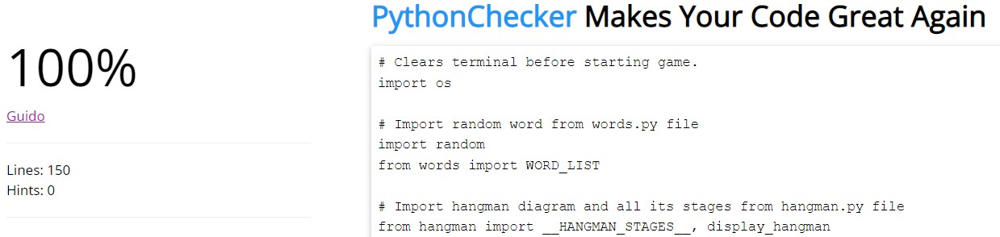
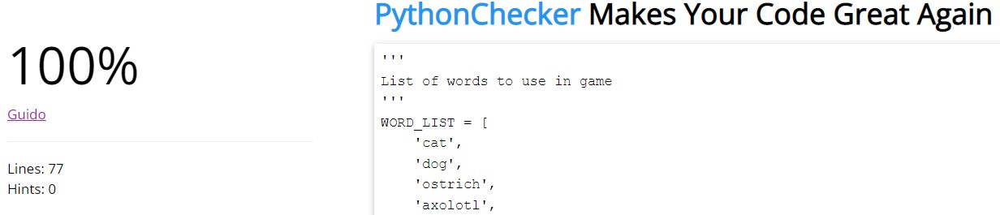

# Hangman

Welcome to Hangman, a simple game based on a childhood classic. In this game the user can must guess the correct letters from a random word, one letter at a time. However they must race to complete the word before running out of tries, as each incorrect guess builds a stage of the hangman. If the entire hangman is completed it's game over! So choose your letters wisely. In this game the user can play as many times as they want, with a list of over 50+ possible words available. This project being my first ever Python based project was extremely fun to make so I hope you enjoy!

### Link to deployed app: https://hangman-project.herokuapp.com/

--- example screenshot? ---

---

## User Expectations / Stories

- As a user I want to be able to play a game of Hangman
- As a user I want to be able to see clearly what letters I have already guessed
- As a user I want to be able to play the game as many times as I want
- As a user I want a variety of words to guess from to keep the game interesting

---

## Existing Features:

- Firstly there is a welcome message to user. Then they are asked if they want to play the game.

- Upon answering no the user is told how they can start the game again if they change their mind.

- If they answer yes, the game begins and an empty word is diplayed along with the base stage of the hangman.

- The user can then enter a letter of their choice, pressing enter to submit the letter. From here there are four possible outcomes:

1. The letter is not in the word. The letter is added to the 'Letters guessed:' list for the user to see. They are notified with a print statement that the letter is not in the word, and one stage of hangman is added and displayed.

2. The letter is in the word. The letter is added to the 'Letters guessed:' list for the user to see. They are notified with a print statement that the letter was correct, and it is added into the word.

3. The letter is already guessed. Reguardless of if it's in the word or not, if the letter is in the 'Letters guessed:' list they will be notified with a print statement that they already guessed that letter.

4. The user input is invalid. The user must enter one single letter, or they will be told their answer was invalid and asked again for an input. Letters are not case sensitive.

- At the end of each of these the user is asked again for an input until the word or hangman are complete.

- If the hangman is complete they are told that have run out guesses, and it's game over. The word is then revealed to them so they can see what it was.

- If the word is complete they are congratulated on their win.

- After either of these outcomes the user is asked again if they would like to play, and the cycle continues.

---

## Future Features:

- An option to be able to choose the difficulty setting would make the game more suitable for different age ranges. For example children could choose to play on an easier setting that chooses from a list of shorter, more common words.

- An option to be able to play against a friend would make to game more interactive. If there was a two player option the players could take it in turns to choose the word for each other. There could even be a score system where each are awarded a point for correctly guessing a word, and the first to five points wins.

---

## Technologies:

- Python was the main coding language I used for this project. All the game code is written in Python.
- I used [Github](https://github.com/) along with a Python template to create my repository and [Gitpod](https://www.gitpod.io/) for writting the code.
- I used [Heroku](https://www.heroku.com) to deploy my project.

---

## Testing:

--- screenshots ---

## Validator Testing:

- I tested my code using [Python Syntax Checker PEP8](https://www.pythonchecker.com) and found one indentation error which I quickly fixed resulting in no errors.

Validation of run.py file:

Validation of hangman.py file:

Validation of words.py file:

---

## Bugs

- I had a bug where the legs of the hangman diagram were made of slashes like so: / \ . However the program saw the backslash as something that shouldn't be displayed for some reason. This resulted in him always having one leg and offset the bottom of the stand onto to right end of the next line. Basically it ruined the final stage of the diagram and I had to rework it by making the legs L's instead. This seemed to fix the issue as the program no longer recognised the punctuation as a kind of command or syntax for something else.

Before:

After:

---

## Deployment:

### Gitpod

- Typing 'python3 -m http.server' into the Gitpod terminal and clicking open browser on the pop up window allows you to view the site in a browser as if it were live.
- Every time a secton of code is added the browser can be refreshed to see the change. Sometimes you need to press ctrl, shift and R at the same time for changes to be updated.
- To save your progress, type 'git add .' into the terminal to add all your changes, followed by 'git commit -m' and then your message describing what you did in double quotes.
- Lastly type'git push' and this will push your code along with all the saved changes. This should be done at the end of every coding session or whenever you want an already deployed site to be updated.

### Github and Github Pages

- To deploy my site I first went to Github and found my project repository on the left hand side and clicked it.
- I then clicked on 'Settings' and then the 'Pages' option on the left.   
- Here I changed the branch from 'none' to 'main'.
- Finally I clicked save and after a short while a link to my deployed site is displayed on screen.
- It can take a few minutes, but if nothing happens I find that typing anything in the 'Custom domain' input box and pressing enter can cause the page to produce the link.
- I made sure to click on the link to check that it worked.

### Heroku

- I deployed my site using Heroku.

---

## Credits:

- Line 55-63 of the run.py file takes heavey inspiration from a YouTube tutorial by a channel called 'Kite'. I had a lot of trouble and spent a lot of time trying to figure ouut how to write this part of the code.
- I knew I wanted the correct letters to replace the underscores in the word when guessed but I was'nt sure how to do this. I knew that I would need the program to iterate through the individual letters of the word
and see if they matched to the users guess. What I didn't know until watching this tutorial was that I could use the '.join' method to the add that letter in if it did match.
- Link to the video: https://www.youtube.com/watch?v=m4nEnsavl6w&t=510s&ab_channel=Kite (specifically at 4:40)

---